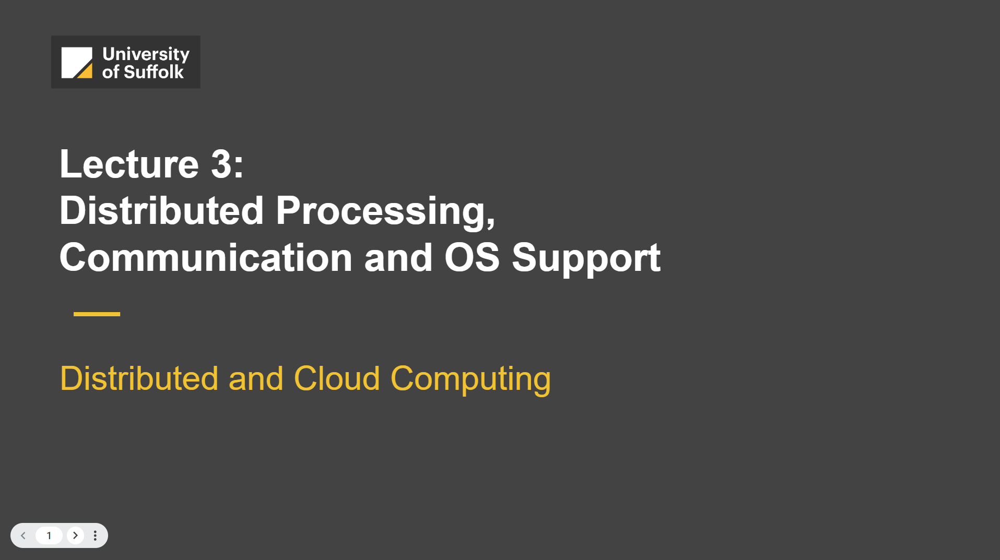

<a href="../02-distributed-storage/"> (< Previous Lecture)</a>  |  <a href="../04-distributed-architectures/">( > Next Lecture)</a>

## 🟢 03 - Distributed Processing

In the last lecture, we looked at **storage in the cloud**, and concepts such as **block vs object storage**. We also looked at different ways that we can store big data such as the principles behind **distributed vs centralised storage** and examples of different AWS storage services such as AWS EBS, AWS S3. We also looked at some dedicated services for transactions data (streaming data) such as AWS SFx.

### 1. Lecture Overview

In this lecture, we look at different **computing services in the cloud**, starting from the core IaaS offering AWS EC2 and how it can be used as one of the 2 core services for building applications in the cloud. We will look at examples of how to set it up as well as ways to ensure it is secured. We will also look at other sister computing cloud services such as AWS Lambda and AWS Elastic Beanstalk.

We will also look at **containers and virtual machines**, their basic principles of operating and tryout a lab on setting one up on AWS.

In the second part of this lecture, we will look at **distributed processing** (threads, virtualisation), inter-process communication and remote invocation of code and data for distributed systems and techniques for communication between elements of a distributed system. We also consider how that communication is underpinned theoretically through different approaches and how distributed systems are supported by operating systems. More on this in [Lecture 05: Distributed Communication](../05-distributed-communication/).

### 2. Slides

[click here to see the slideshow](
    https://docs.google.com/presentation/d/10Y9EEfhKuETNoDauypW5H60Ur3xktUyfzLI0LrUhw5k/embed?start=false&loop=false&delayms=3000
    )

### 3. Readings for this lecture

Detailed information for today's key concepts can be found in the following readings:

* Chapter 03 in the van Steen and Tannenbaum (2023) book
* 📘 Reading 3-1: [A survey on cloud computing | IEEE Conference Publication | IEEE Xplore](https://ieeexplore.ieee.org/abstract/* document/6921423)
* 📘 Reading 3-2: [AWS Compute Services category icon Compute services - Overview of Amazon Web Services](https://docs.aws.amazon.com/whitepapers/latest/aws-overview/compute-services.html)
* 📘 Reading 3-3: [Compute on AWS - Amazon Web Services](https://aws.amazon.com/products/compute/) 
* 📘 Reading 3-4: [AWS re:Invent 2023 - What’s new with Amazon EC2 (CMP102) (youtube.com)](https://www.youtube.com/watch?v=mjHw_wgJJ5g&list=PL2yQDdvlhXf-CN3ykMq_dYH9nmPRRbR7O&index=11)

### 4. Labs:

The following labs are available for University of Suffolk students to work on as part of their practical (in the lab and continuing during self-study):

* AWS Cloud Foundations: Lab - 3 Introduction to Amazon EC2 (instructure.com) 
* AWS Cloud Foundations: Activity - AWS Lambda (instructure.com) 
* AWS Cloud Foundations: Activity - AWS Elastic Beanstalk (instructure.com) 

### 5. Demos:

* [Console Demonstration - EC2 (instructure.com)](https://awsacademy.instructure.com/courses/78837/modules/items/7113276) - restricted access to University of Suffolk Students only

### 6. Case Studies:

* [Expedia Case Study (amazon.com)](https://aws.amazon.com/solutions/case-studies/expedia/)
* [AWS re:Invent 2023 - Compute - YouTube](https://www.youtube.com/playlist?list=PL2yQDdvlhXf-CN3ykMq_dYH9nmPRRbR7O)

## Great Work! Keep on learning 🎉💯
Next we look at [**distributed architectures**](../04-distributed-architectures/).